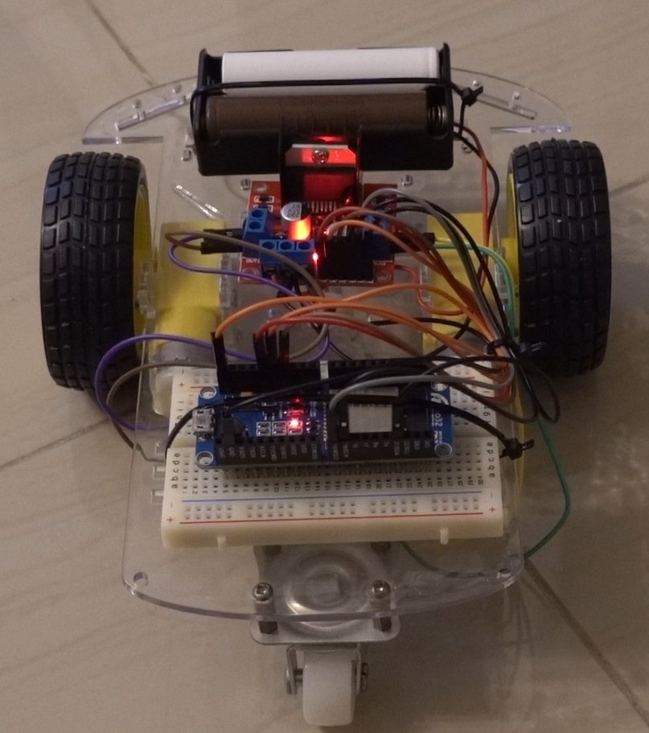
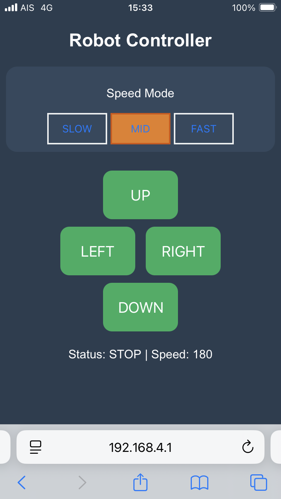
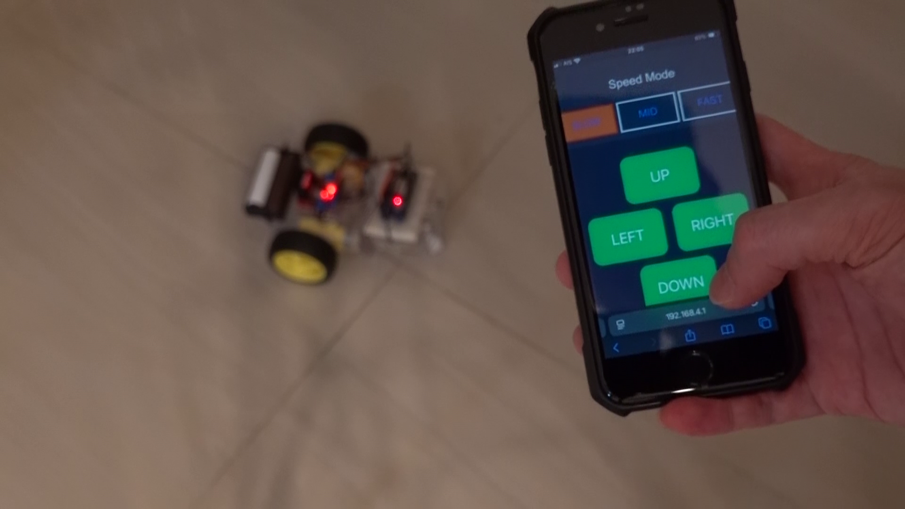

# ESP32-Differential-Drive-WebControl

  

https://youtu.be/6cGIzCCgsug

ESP32 Differential Drive Web Control
หุ่นยนต์สมาร์ทคาร์ขับเคลื่อนแบบ 2 ล้อ (Differential Drive) ควบคุมผ่านหน้าเว็บ Dashboard โดยใช้ ESP32 (ESPino32) เป็นหน่วยประมวลผลหลัก และใช้ระบบปฏิบัติการ FreeRTOS ในการจัดการภารกิจแบบขนาน

🛠 อุปกรณ์ที่ใช้ (Hardware Requirements)
Microcontroller: ESPino32 (ESP-WROOM-32)

Motor Driver: L298N Dual H-Bridge Motor Driver

Power Source: แบตเตอรี่ Li-ion 18650 จำนวน 2 ก้อน (7.4V)

Chassis: โครงรถหุ่นยนต์ (Smart Car Chassis) พร้อมมอเตอร์ DC 2 ตัว

Breadboard & Jumper Wires: สำหรับการเชื่อมต่อวงจร

  

Dashboard UI & Hardware Integration ภาพรวมการทำงานของระบบควบคุมหุ่นยนต์ผ่าน WiFi Access Point:

UI Design: ใช้ HTML/CSS/JS สร้างหน้าเว็บรีโมทที่รองรับระบบ Multi-touch (กดค้างวิ่ง-ปล่อยหยุด)

Speed Control: ส่งค่าความเร็วผ่าน HTTP Request ไปเปลี่ยนตัวแปร PWM ใน ESP32 แบบ Dynamic

Power System: จ่ายไฟจาก L298N (5V Out) เข้าขา Vin ของ ESPino32 เพื่อความปลอดภัยและประหยัดพื้นที่

Processing: ใช้ศักยภาพของ ESP32 ในการรัน Web Server ที่ Core 0 เพื่อไม่ให้รบกวน Loop การควบคุมมอเตอร์ที่ Core 1"

  

